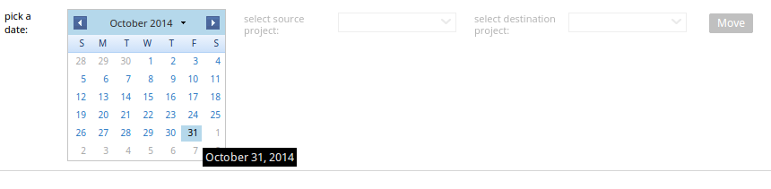
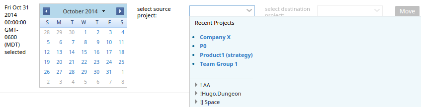
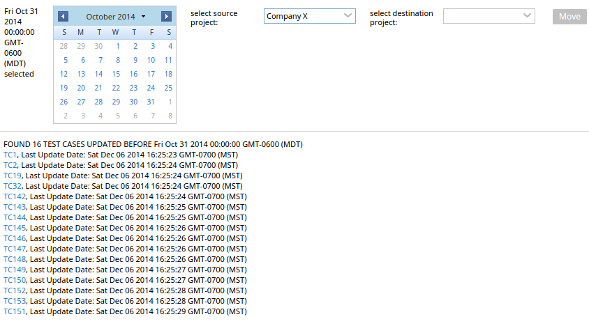
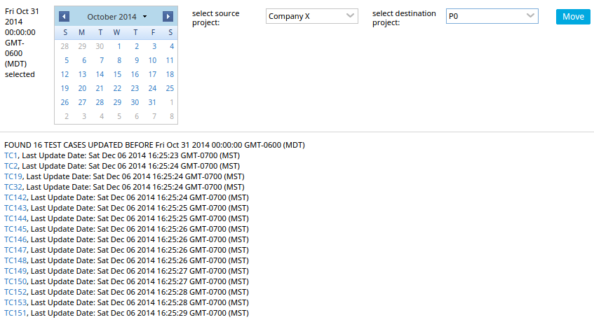
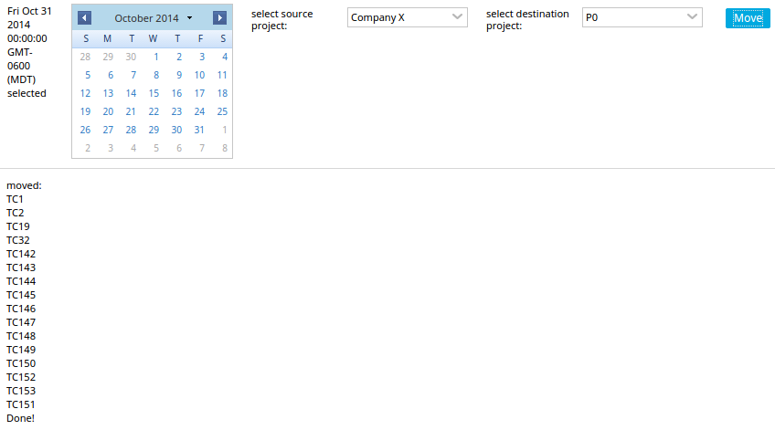

Bulk move TestCases between projects within the same workspace
=========================

## Overview

Bulk-edit functionality on TestCases summary page can be used to update Project attribute
on mulitple TestCases. However, if you have thousands of TestCases to move between projects
even with max page size of 200 the action has to be done repeatedly, per page.

This app bulk-moves TestCases between two projects without the need for the user to page manually.

This example queries TestCases by LastUpdateDate. TestCases last updated before the date selected by
the user will be moved from source project to destination project.
The source code in App.js can be modified to use a different query.
The choice of LastUpdateDate is natural in a scenrio when old TestCases need to be moved to an "archived" project.

The date must be selected first. All other components are grayed out:

After the date is selected, source project combobox is enabled. Select source project:

Wait for query to complete. Depending on the size of the result this may take long time.
Verify the results to make sure this is the subset of test cases you want to move.

After source project is selected the destination project combobox is enabled:

Click Move. List of moved TestCases is updated in real time until it's done.

This app example is vailable AS IS. It is NOT supported by Rally.

## License

AppTemplate is released under the MIT license.  See the file [LICENSE](./LICENSE) for the full text.

##Documentation for SDK

You can find the documentation on our help [site.](https://help.rallydev.com/apps/2.0rc3/doc/)
